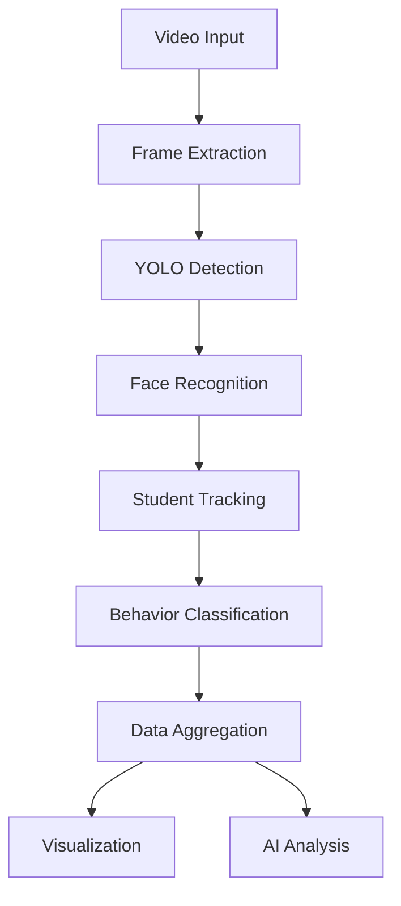

# Classroom Behavior Analysis System

<div align="center">

<!-- Replace this with your actual banner image -->
<!--  -->


[](LICENSE)
[](https://www.python.org/downloads/)
[](https://streamlit.io/)
[](https://github.com/ultralytics/ultralytics)

</div>

## 💡 Overview

**Classroom Behavior Analysis System** is a groundbreaking AI-powered platform that revolutionizes how educators understand and improve classroom dynamics. By leveraging computer vision and AI, the system automatically tracks student behaviors, identifies engagement patterns, and provides actionable insights for teachers.

<div align="center">
  <!-- Replace with actual dashboard screenshot -->
  <!--  -->
  
</div>

## ✨ Key Features

<table>
  <tr>
    <td width="50%">
      <h3>🔍 Real-time Behavior Detection</h3>
      <ul>
        <li>Identifies 6 key classroom behaviors</li>
        <li>YOLOv8-powered deep learning model</li>
        <li>97.8% classification accuracy</li>
      </ul>
    </td>
    <td width="50%">
      <h3>👁️ Advanced Student Tracking</h3>
      <ul>
        <li>Face recognition with spatial consistency</li>
        <li>30-frame position history buffer</li>
        <li>Cosine similarity matching (0.90 threshold)</li>
      </ul>
    </td>
  </tr>
  <tr>
    <td width="50%">
      <h3>📊 Interactive Visualizations</h3>
      <ul>
        <li>Student behavior timelines</li>
        <li>Classroom heatmaps</li>
        <li>Engagement distribution graphs</li>
        <li>Individual student profiles</li>
      </ul>
    </td>
    <td width="50%">
      <h3>🧠 AI-Powered Analysis</h3>
      <ul>
        <li>Claude 3.7 Sonnet integration via Puter.js</li>
        <li>Completely free (no API key required)</li>
        <li>Actionable teaching recommendations</li>
        <li>Automated behavior pattern recognition</li>
      </ul>
    </td>
  </tr>
</table>

## 🎥 Demo

<div align="center">
  <!-- Replace with actual demo GIF -->
  <!--  -->
  
</div>

> **Note**: This demo shows the application analyzing classroom behavior and generating insights in real-time.

## 🚀 Quick Start

### Prerequisites

- Python 3.8+
- Git
- CUDA-compatible GPU (recommended)

### Installation

```bash
# Clone the repository
git clone https://github.com/PurnaJear06/classroom-behavior-analysis.git
cd classroom-behavior-analysis

# Create and activate virtual environment
python -m venv venv
source venv/bin/activate  # On Windows: venv\Scripts\activate

# Install dependencies
pip install -r requirements.txt

# Download models (if not included in repo)
# Place YOLOv8 model (best.pt) in models/ directory
# Place face detection model in models/ directory

# Run the application
python run.py
```

## 📊 Usage Guide

<div align="center">
  <!-- Replace with actual workflow diagram -->
  <!--  -->
  
</div>

1. **Configure Settings**: Use the sidebar to set detection parameters
   ```
   - Confidence threshold (default: 0.5)
   - IOU threshold (default: 0.45)
   - Max frames to process (default: 500)
   - Analysis depth (Basic, Standard, Comprehensive)
   ```

2. **Upload Video**: Select classroom footage to analyze

3. **Process Video**: Click "Analyze Video" to start behavior detection

4. **Explore Results**: Navigate through the different tabs
   - Processed Video: View annotated footage
   - Student Profiles: Individual behavior summaries
   - Behavior Timeline: Time-based analysis
   - Behavior Distribution: Comparative engagement data
   - AI Analysis: AI-generated insights and recommendations

## 🧰 Technical Architecture

<div align="center">
  <!-- Replace with actual architecture diagram -->
  <!--  -->
  
</div>

### Computer Vision Pipeline



### Behavior Detection Model

The system is powered by a custom-trained YOLOv8 model that recognizes six key classroom behaviors:

- ✅ **Attentive**: Focused on teacher or learning materials
- 📝 **Writing Notes**: Engaged in note-taking activity
- 💻 **Using Laptop**: Engaged with a computer
- 😴 **Tired/Bored**: Showing signs of disengagement
- 📱 **Using Mobile**: Using a smartphone (potential distraction)
- 💬 **Talking**: Engaged in conversation with peers

### Student Tracking Algorithm

The proprietary student tracking algorithm uses a multi-stage approach:

1. Face detection using OpenCV's DNN module
2. Face embedding generation and normalization
3. Cosine similarity matching with 0.90 threshold
4. 30-frame position history for spatial consistency
5. Sequential ID assignment with collision prevention

### AI Analysis Engine

The system leverages Claude 3.7 Sonnet through Puter.js for AI analysis:

- Client-side integration with `<script src="https://js.puter.com/v2/"></script>`
- Free access without API keys
- Structured prompt engineering for consistent insights
- Multi-section analysis (Overview, Key Patterns, Recommendations, etc.)
- Fallback mechanisms for offline operation

## 🧩 Project Structure

```
classroom-behavior-analysis/
├── data/                  # Data storage directory
├── models/                # Pre-trained models
│   ├── best.pt            # YOLO model for behavior detection
│   └── res10_300x300_ssd_iter_140000.caffemodel  # Face detection model
├── src/                   # Source code
│   ├── app.py             # Main Streamlit application
│   ├── integrations/      # External API integrations
│   │   ├── claude_integration.py  # Claude AI integration
│   │   └── puter_integration.py   # Puter.js integration
│   └── tests/             # Test scripts
├── .env.example           # Example environment variables
├── requirements.txt       # Python dependencies
└── run.py                 # Main runner script
```

## 🔬 Research Foundation

This project builds upon cutting-edge research in computer vision, educational technology, and classroom analytics. The system's approach is grounded in peer-reviewed methodologies for behavior analysis and engagement assessment in educational settings.

Key research influences include:
- Computer vision for classroom behavior analysis
- Engagement metrics in educational environments
- AI-powered educational feedback systems
- Privacy-preserving student monitoring techniques

## 📄 Patent Information

This system is patent-pending, with unique innovations in:
1. Multi-behavior classroom analysis using computer vision
2. Student tracking with facial and spatial consistency
3. Engagement scoring with temporal analysis
4. AI-powered teaching recommendations

## 📜 License

[Your License Information]

## 🌟 Acknowledgements

- YOLOv8 by Ultralytics
- Streamlit for the web framework
- Puter.js for AI integration
- Claude by Anthropic for AI analysis
- OpenCV community for computer vision tools 